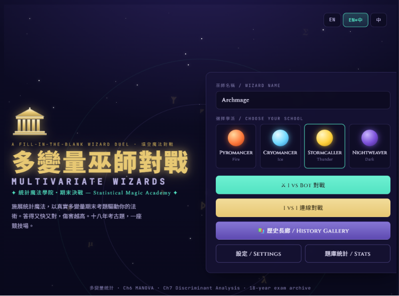
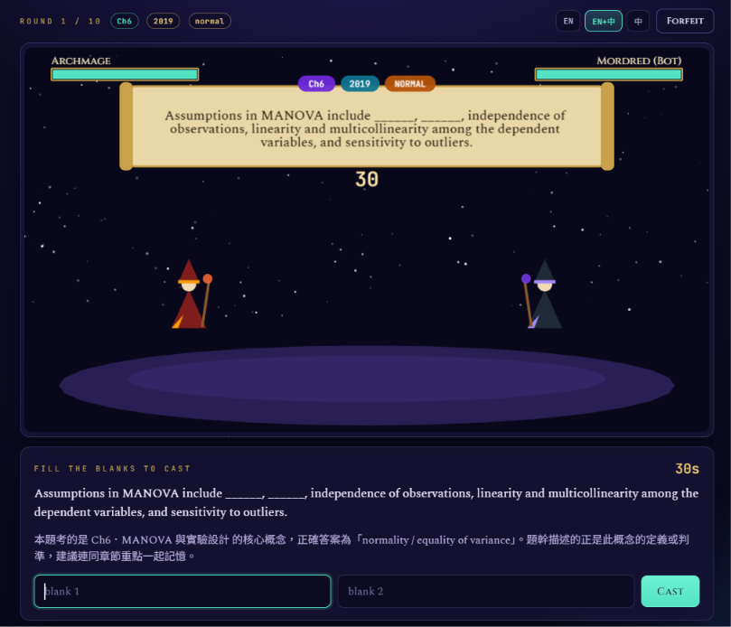
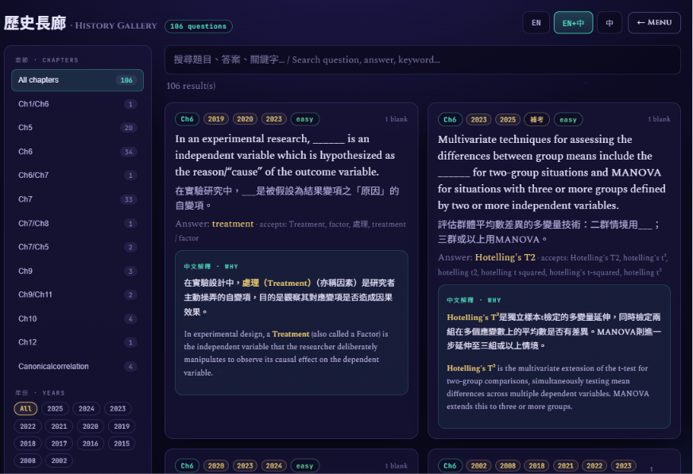

# 🧙 Multivariate Wizards (多變量巫師對戰)

*[English version below](#english-version)*

🎮 **[線上直接遊玩 / Play Online](https://multivariate-wizards-2.onrender.com/)**

<!-- TODO: 請將您上傳的三張圖片存入專案（例如放入 assets/ 資料夾），並將以下括號內的檔名替換為實際的圖片路徑！ -->




這是一款基於 18 年多變量統計期末考題庫打造的填空題**巫師對戰遊戲**。兩位巫師將進行對決；每一回合都會顯示真實的考題與空格。輸入正確的術語即可施放魔法 —— **答題越快、越正確，傷害就越高**，連續答對還能累積連擊數（combo），最先將對手生命值（HP）歸零的巫師即可獲勝。支援與機器人對戰或與朋友線上連線。

這是一個披著遊戲外衣的學習工具：題庫、答案檢查機制（包含可接受的同義詞與變體）以及每回合結束後的錯題回顧，全都是從真實考試中擷取而來。

---

## 🚀 快速開始

```bash
npm install
npm run import:questions   # 解析 .docx 題庫 → JSON
npm run dev                # 同時啟動伺服器 (:3001) 與客戶端 (:5173)
```

然後開啟 **http://localhost:5173**。

- **與機器人對戰**：完全支援離線遊玩，題目由靜態檔案提供。
- **線上 1v1**：在兩個分頁或裝置中開啟網頁，其中一人建立房間並獲得 6 碼代碼，另一人輸入代碼加入，雙方皆按下「準備」即可開始。

> `import:questions` 步驟會讀取專案根目錄下的 `多變量期末_終極大考古_涵蓋18年來所有試題.docx`（已內建）。如果要指定其他檔案：請執行 `DOCX_PATH=/path/to/exam.docx npm run import:questions`。如果缺少此檔案，遊戲仍會使用內建的基本題庫執行。

### 📜 其他腳本

| 腳本 | 功能說明 |
| --- | --- |
| `npm run dev:server` | 僅啟動伺服器，支援熱更新 |
| `npm run dev:client` | 僅啟動客戶端 |
| `npm run build` | 建置正式版客戶端 → 輸出至 `dist/` |
| `npm run preview` | 預覽正式版建置結果 |
| `npm run start:server` | 啟動伺服器（無熱更新） |

---

## ⚔️ 對戰機制

- 每一回合會出現一題包含一個或多個空格的考題。
- 檢查答案前會進行正規化：忽略大小寫、空格與標點符號，`T²` 與 `T2` 視為相同。每個空格皆支援題庫內紀錄的多種變體寫法（例如 *discriminant function / discriminant variate*）。多格填空題會逐格檢查。
- **傷害**取決於您的剩餘時間與當前的連擊數。若雙方皆答對，速度較快者可造成全額傷害，較慢者傷害減半；答錯或未作答則不會造成傷害。精確的傷害公式位於 `shared/gameLogic.ts` 中，無論是線上伺服器或是本機機器人引擎，皆**統一使用此公式**計算。
- 擊倒對手（HP 歸零）即可獲勝；若雙方在所有題目結束後都存活，則 HP 較高者獲勝，其次比對正確題數，否則視為平手。
- 對戰結束後，您會看到數據統計比較，並可進行**錯題回顧**以查看正確答案。

對戰題數、每題作答時間、語言（EN / EN+中 / 中）、標籤顯示以及機器人難度等設定，皆可於設定（Settings）畫面中調整。遊戲中還附有**題庫長廊（Question Bank）**，提供綜合統計數據以及可搜尋所有題目與答案的列表。

---

## 🏗️ 系統架構

一個小型的 monorepo（單體儲存庫），包含三個無依賴的共用模組，確保客戶端、伺服器以及匯入腳本在規則上保持一致。

```
shared/        型別、答案檢查、傷害公式（無外部依賴；被各處引入）
scripts/       docx → JSON 匯入管線（解析、去重、雙語化）
server/        Express + Socket.IO，權威的線上遊戲迴圈
client/        React（選單/大廳/輸入框） + Phaser（對戰視覺效果）
data/          自動產生的 JSON 檔案（題庫、報告）
assets/        資源版權與來源說明（見下方）
```

**客戶端的職責劃分：** React 負責所有與文字和表單相關的部分：選單、設定、線上大廳、答案輸入框、答案揭曉面板以及統計頁面。Phaser **僅負責**對戰視覺效果（巫師、法術、血條）。兩者透過一個小型的事件匯流排 (`client/src/game/EventBus.ts`) 進行解耦：機器人引擎和線上 socket 橋接器都會發出**相同的事件**，因此無論對手是機器人還是真人，對戰畫面與 Phaser 場景都是完全相同的。

**線上對戰流程：** 伺服器具有絕對的權威。它負責挑選題目、執行倒數/出題/揭曉的迴圈、驗證答案、計算傷害以及追蹤數據；客戶端僅負責渲染接收到的畫面並送出作答。詳見 `server/src/socket.ts`。

### ⚙️ 匯入管線

`npm run import:questions` (→ `scripts/importQuestions.ts`):

1. 使用 `mammoth` 讀取 `.docx` 並根據章節與年份進行分割。
2. 解析編號的題目及其答案，包含粗體字元的 `𝐀𝐧𝐬𝐰𝐞𝐫:` 格式與多種空格符號（`______`, `╴╴╴`）。`/` 代表可接受的變體寫法；`;` 用於分隔多個空格。
3. 偵測章節、知識點標籤、空格數量與難易度。
4. **去重**：跨年份去重（相同章節 + 相同答案，或用詞高度相似者），並合併年份/來源/變體寫法，保留最完整的題目敘述。
5. 寫出遊戲使用的 JSON 檔案，以及一份重複項目報告與警告檔案。

在內建的題庫中，這會將 **264 題原始題目 → 轉換為 106 題獨立考題、57 組重複題、0 個解析警告**，涵蓋 2002–2025 的期末考與各章節練習題。

輸出於 `data/` 目錄：`questions.raw.json`, `questions.deduped.json`, `questions.bilingual.json`, `duplicate-report.json`, `import-warnings.json`。
去重後的題庫也會發布至 `client/public/questions.json`，讓機器人與題庫長廊頁面可以在沒有伺服器的情況下運作。

> **翻譯備註：** 中文 (`questionZh`) 欄位是一個輕量的框架，保留了英文的統計專業術語，而非全面的機器翻譯——目前的建置中沒有翻譯 API 金鑰。如果想串接翻譯，可修改 `scripts/translateQuestions.ts` (`buildBilingual`)。

---

## 🎨 遊戲資源

這個版本**沒有包含任何第三方的圖片或音效**。所有的視覺效果都是透過 Phaser 的 `Graphics` API 程式化繪製的，所有聲音也都是使用 Web Audio API 在瀏覽器中合成的——因此遊戲可以完美啟動並運行，完全沒有缺失資源的錯誤，也沒有任何版權義務。

這是一個刻意的設計：由於建置環境的網路限制，無法連線至外部的遊戲資源網站。資源載入器與音效管理器已經設定為：若您加入實體檔案則會**優先使用**它們，否則會安靜地退回到合成版本。請參閱 **`assets/credits.md`** 與 **`assets/audio/credits.md`**，了解如何將 CC0 / 公有領域 / 免版權費的資源放入對應的資料夾，以及如何標註來源。

---

## ✅ 驗證狀態

誠實的狀態回報，因為並非所有功能都能在無頭沙盒環境中測試：

- ✅ **匯入管線** — 使用內建的 docx 實際執行：264 題 → 106 題，0 警告。
- ✅ **伺服器** — 成功啟動並載入 106 題，API 回應正確。
- ✅ **客戶端建置與型別檢查** — 編譯與型別檢查皆順利通過。
- ⚠️ **瀏覽器遊玩與雙客戶端連線對戰** — 在建置環境中**未**進行實際執行測試（無瀏覽器與顯示器）。所有組件已完成端到端串接，但若在本機執行時遇到問題，最有可能出現在這裡。

---

## 💻 技術堆疊

全程使用 TypeScript · React 18 + Vite · Phaser 3 · Express + Socket.IO · `mammoth` 處理 docx 解析。建議使用 Node 18+。

---

## 🆕 更新紀錄 — 雙語強化版

這次在原有架構上做**增量修改**，未重寫既有功能。重點如下：

### 🌐 1. 雙語題目 + 中文解釋
- 題庫已用參考刷題站（`multivariate_ultimate_quiz`）的內容回填：**106 題全部**具備真實 `questionZh`、`explanationZh`、`explanationEn`，並合併中文答案變體（94% 與參考題庫成功比對，其餘以模板補齊，永不顯示 `undefined`）。
- 對戰中題目支援 **EN / 中 / EN+中** 切換（Battle 右上）。`questionZh` 缺漏時自動 fallback 顯示英文。
- 作答後 reveal 面板顯示：正確答案、你的作答、答題時間、傷害、章節/年份標籤、**中文解釋**（EN+中 模式同時顯示英文解釋）。
- 結算頁錯題回顧也附中文解釋。
- 資料結構新增 `explanationZh?` / `explanationEn?`（見 `shared/types.ts`）。fallback 由 `shared/answerUtils.ts` 的 `explanationZhFor / explanationEnFor / questionZhFor` 提供。

### ⏳ 2. 1 vs Bot 倒數流程
- 時間到 **不再自動跳題**，顯示「時間到！」與「顯示答案」按鈕。
- 時間到後仍可輸入作答練習：**答對固定造成 1 點傷害**（不套用速度公式），答錯 0 點。
- 必須按「下一題 / Next →」才會進入下一題。單題每位玩家最多造成一次傷害。
- **1 vs 1 Online 不受影響**（線上模式不經 `BattleManager`，仍由 server 主導）。

### 📚 3. 題庫長廊 / Question Gallery（新頁）
- 首頁新增「📚 題庫長廊」按鈕進入。
- 功能：章節分類、年份分類、關鍵字搜尋、顯示/隱藏答案、EN/中/EN+中 切換、**練習模式**（先隱藏答案、點擊揭示）。
- 卡片顯示：題目英文/中文、答案、中文解釋、章節/年份標籤、是否補考、acceptedAnswers。
- 直接讀取專案自身的 `client/public/questions.json`（無需轉換；資料已在匯入/回填階段整合）。

### 🎵 4. BGM 與音效
- `AudioManager` 新增 **程式合成 BGM**（`SynthBgm`）：lobby / battle / result 三種場景各有合適旋律 —— 即使沒有任何音樂檔也有音樂、不會崩潰、無版權問題。
- 接線：選單/大廳播 lobby、第一回合開始切 battle、結算停止。
- 設定頁新增 **Master / BGM / SFX 音量滑桿 + 靜音**。
- 首次點擊後才播放（符合瀏覽器自動播放限制）。
- 要換成正式音樂：把檔案放到 `client/public/audio/bgm|sfx/`，遊戲會自動優先載入（見 `assets/audio/credits.md`）。

### 👁️ 5. 首頁視覺
- 深色星空背景、漂浮符文、緩慢魔法圓環。
- 金色發光雙語標題（多變量巫師對戰 / Multivariate Wizards）+ 副標「統計魔法學院・期末決戰」。
- 右上角語言切換（EN / 中 / EN+中），按鈕：1vBot、1v1 Online、題庫長廊、設定、題庫統計。
- 支援 1366×768 與 1920×1080（含 880px / 820px 響應式斷點）。

### 🚀 啟動方式（不變）
```bash
npm install
npm run import:questions   # 可選：重新產生題庫 JSON（解析 docx，失敗則 fallback）
npm run dev                # 同時啟動 client + server
# 或分開： npm run dev:client / npm run dev:server
```

### 🔄 重新產生中文翻譯/解釋（選用）
中文翻譯與解釋來自 `data/reference-gallery.json`（取自參考刷題站，含 `zh / explainZH / explainEN`）。
若日後更新題庫，可重跑回填：
```bash
node scripts/enrichQuestions.cjs   # 比對回填 questionZh / explanationZh / explanationEn 到 questions.json
```

<br>
<br>

---

# English Version

🎮 **[Play Online](https://multivariate-wizards-2.onrender.com/)**

<!-- TODO: Please save your uploaded images into the project (e.g., into the assets/ folder) and replace the filenames in the brackets below with the actual image paths! -->


A fill-in-the-blank **wizard duel** built on top of an 18-year multivariate-statistics final-exam bank. Two wizards face off; every round shows a real exam question with blanks. Type the right term to cast a spell — **faster, correct answers hit harder**, combos build up, and the first wizard to drop their opponent's HP to zero wins. Play against a bot or a friend online.

It's a study tool wearing a game's clothing: the question bank, the answer checking (with accepted variants), and the per-round review all come straight from the real exams.

---

## 🚀 Quick start

```bash
npm install
npm run import:questions   # parse the .docx exam bank → JSON
npm run dev                # server (:3001) + client (:5173) together
```

Then open **http://localhost:5173**.

- **Duel the Bot** works fully offline (questions are served from a static file).
- **Online 1v1**: open the page in two tabs/devices, host in one (you get a 6-letter code), join with it in the other, both press **Ready**.

> The `import:questions` step reads `多變量期末_終極大考古_涵蓋18年來所有試題.docx` from the project root (already included). To point at a different file: `DOCX_PATH=/path/to/exam.docx npm run import:questions`. If the docx is ever missing, the game still runs from a built-in seed set.

### 📜 Other scripts

| Script | What it does |
| --- | --- |
| `npm run dev:server` | Server only, with hot-reload (tsx watch) |
| `npm run dev:client` | Client only (Vite) |
| `npm run build` | Production client build → `dist/` |
| `npm run preview` | Preview the production build |
| `npm run start:server` | Run the server without watch |

---

## ⚔️ How a duel works

- Each round serves one exam question with one or more blanks.
- Answers are normalized before checking: case/spacing/punctuation are ignored, `T²`/`T2` are treated alike, and each blank accepts the variants recorded in the bank (e.g. *discriminant function / discriminant variate*). Multi-blank questions are checked per blank.
- **Damage** scales with how much time you had left and your current combo. If both players are correct, the faster one lands a full hit and the slower one's is halved; a wrong (or empty) answer deals nothing. The exact formula lives in `shared/gameLogic.ts` and is used **identically** by the server (authoritative for online) and the bot engine.
- Win by knockout; if both survive all questions, higher HP wins, then higher correct count, otherwise it's a draw.
- After the match you get a stat comparison and a **review of every question you missed** with the correct answers.

Settings (questions per duel, time per question, language EN / EN+中文 / 中, tag visibility, bot difficulty) are on the Settings screen. There's also a **Question Bank** browser with aggregate stats and a searchable list of all questions and answers.

---

## 🏗️ Architecture

A small monorepo with three dependency-free shared modules so the client, server, and import scripts all agree on the rules.

```
shared/        types, answer-checking, damage formula  (no deps; imported everywhere)
scripts/       docx → JSON import pipeline (parse, dedupe, bilingual)
server/        Express + Socket.IO, authoritative online game loop
client/        React (menus/lobby/inputs) + Phaser (battle visuals)
data/          generated JSON (questions.*.json, reports)
assets/        credit/provenance notes (see below)
```

**Division of labour on the client:** React owns everything that involves text and forms — menus, settings, the online lobby, the answer input boxes, the reveal overlay, the stats page. Phaser owns *only* the battle visuals (wizards, spells, health bars). The two are decoupled by a tiny event bus (`client/src/game/EventBus.ts`): the bot engine and the online socket bridge both emit the **same events**, so the battle screen and Phaser scene are identical across modes and don't care whether the opponent is a bot or a human.

**Online flow:** the server is authoritative. It picks the questions, runs the countdown/question/reveal loop, validates answers, computes damage, and tracks stats; clients just render what they're told and submit blanks. See `server/src/socket.ts`.

### ⚙️ The import pipeline

`npm run import:questions` (→ `scripts/importQuestions.ts`):

1. Reads the `.docx` with `mammoth` and splits it into sections (`Exercise_Ch6`, `期末考試題2025`, `期末考試題2002 ~ 2008`, …).
2. Parses numbered questions and their answers — including the Unicode math-bold `𝐀𝐧𝐬𝐰𝐞𝐫:` form and several blank glyphs (`______`, `╴╴╴`). `/` marks accepted variants; `;` separates blanks.
3. Detects chapter, knowledge-point tags, blank count, and difficulty.
4. **Dedupes** across years (same chapter + same answers, or near-identical wording) and merges the years/sources/variants, keeping the fullest wording.
5. Writes the JSON the game uses, plus a duplicate report and a warnings file.

On the included bank this yields **264 raw → 106 unique questions, 57 duplicate groups, 0 parse warnings**, spanning exams from 2002–2025 plus the chapter exercises.

Outputs (in `data/`): `questions.raw.json`, `questions.deduped.json`, `questions.bilingual.json`, `duplicate-report.json`, `import-warnings.json`.
The deduped bank is also published to `client/public/questions.json` so the bot and the Question Bank page work without the server.

> **Translation note:** the Chinese (`questionZh`) field is a lightweight scaffold that keeps statistical terms in English, not a full machine translation — there's no translation API key in this build. The hook to plug one in is `scripts/translateQuestions.ts` (`buildBilingual`).

---

## 🎨 Assets

This build ships with **no third-party art or audio**. Every visual is drawn procedurally with Phaser's `Graphics` API, and all sound is synthesized in the browser with the Web Audio API — so the game starts and plays with zero missing-asset errors and no licensing obligations.

This was a deliberate choice: the build environment's network only allowed package registries, so asset hosts (itch.io, OpenGameArt, Kenney, CraftPix, Game-icons.net, Pixabay, Mixkit, Freesound) were unreachable. The loader and audio manager are already wired to *prefer* real files if you add them and to fall back silently otherwise. See **`assets/credits.md`** and **`assets/audio/credits.md`** for exactly where to drop in CC0 / public-domain / royalty-free assets and how to record attribution.

---

## ✅ What's been verified

Honest status, since not everything could be exercised in a headless sandbox:

- ✅ **Import pipeline** — run for real on the included docx: 264 → 106 questions, 0 warnings.
- ✅ **Server** — boots, loads 106 questions, `GET /api/health` and `GET /api/questions` respond correctly.
- ✅ **Client build & type-check** — `npm run build` and `tsc --noEmit` both pass clean.
- ⚠️ **In-browser play and two-client online matches** were **not** run in the build environment (no browser/display). The pieces are wired end-to-end, but if you hit a rough edge when running locally, that's the most likely place.

---

## 💻 Tech

TypeScript everywhere · React 18 + Vite · Phaser 3 · Express + Socket.IO · `mammoth` for docx parsing. Node 18+ recommended.

---

## 🆕 Bilingual Update

This update applies **incremental changes** on top of the original architecture without rewriting existing features. Key highlights include:

### 🌐 1. Bilingual Questions + Explanations
- The question bank has been backfilled with content from a reference quiz site. **All 106 questions** now have real `questionZh`, `explanationZh`, and `explanationEn`, along with merged Chinese answer variants. 94% matched successfully, and the rest were padded with templates to ensure `undefined` is never displayed.
- In-game toggle supports **EN / 中 / EN+中** at the top right during battles. Automatically falls back to English if `questionZh` is missing.
- After answering, the reveal panel displays: the correct answer, your input, answer time, damage, chapter/year tags, and **Chinese explanations** (along with English explanations in EN+中 mode).
- The post-match mistake review also includes explanations.
- Added `explanationZh?` / `explanationEn?` to data structures. Fallbacks are provided by `answerUtils.ts`.

### ⏳ 2. 1 vs Bot Countdown Flow
- Time up **no longer auto-skips**. It now shows a "Time's up!" message and a "Show Answer" button.
- You can still type to practice after time is up: **correct answers deal a fixed 1 damage** (bypassing the speed multiplier formula), while wrong ones deal 0.
- You must manually click "Next →" to proceed. Each player can only deal damage once per question.
- **1 vs 1 Online is unaffected**. Online mode doesn't use `BattleManager` and is strictly controlled by the server.

### 📚 3. Question Gallery (New Page)
- Added a new "📚 Question Gallery" button on the home screen.
- Features: filter by chapter or year, keyword search, toggle answer visibility, EN/中/EN+中 toggle, and **Practice Mode** (hides answers until clicked).
- Cards display: Question (EN/ZH), correct answer, explanation, tags, and accepted variants.
- Directly reads from `client/public/questions.json` with no transformation required.

### 🎵 4. BGM and SFX
- `AudioManager` now includes **procedurally synthesized BGM** (`SynthBgm`) for lobby, battle, and result screens — ensuring music plays without audio files, preventing crashes, and avoiding copyright issues.
- Wired properly: plays lobby music in menus, switches to battle music in round 1, and stops on the result screen.
- Settings page now features **Master / BGM / SFX volume sliders + mute toggles**.
- Playback requires a first click to comply with browser auto-play policies.
- To use actual music tracks: place files in `client/public/audio/bgm|sfx/` and they will be auto-loaded (see `assets/audio/credits.md`).

### 👁️ 5. Home Screen Visuals
- Dark starry background, floating runes, and a slowly spinning magic circle.
- Golden glowing bilingual title with the subtitle "Statistical Magic Academy".
- Language toggle at the top right. Menu buttons include: 1vBot, 1v1 Online, Question Gallery, Settings, and Stats.
- Supports 1366×768 and 1920×1080 with responsive breakpoints.

### 🚀 Startup Guide (Unchanged)
```bash
npm install
npm run import:questions   # Optional: regenerate question JSON
npm run dev                # Start client + server together
# or separately: npm run dev:client / npm run dev:server
```

### 🔄 Regenerating Translations (Optional)
Chinese translations and explanations are sourced from `data/reference-gallery.json`.
If the question bank is updated in the future, you can rerun the backfill script:
```bash
node scripts/enrichQuestions.cjs   # Backfills data into questions.json
```
